# System setup and tooling
A critical step, and important to understand. Careful, here be dragons!
Even the simplest tooling up can eat up a lot of time, especially when exploring new toolsets and new OSs.
Our goal: Run some Python code in Jupyter notebooks.
Main tools: Anaconda, Jupyter, Git
1.	Anaconda
    - Widely used Python package and environment management, heavily marketed at data science community
    - Free and simple to use, at the expense of some bloat
    - we will use Anaconda to create a new python environment, install some packages, register a Jupyter kernel, launch Jupyter notebooks.
    - https://www.anaconda.com/download#downloads
2.	Git
    - Version control. We will use git to clone example files from GitHub
    - https://git-scm.com/download/win

## Install Anaconda
- Download the correct Anaconda for your OS from https://www.anaconda.com/download#downloads
- Double click the downloaded executable and follow the onscreen prompts:
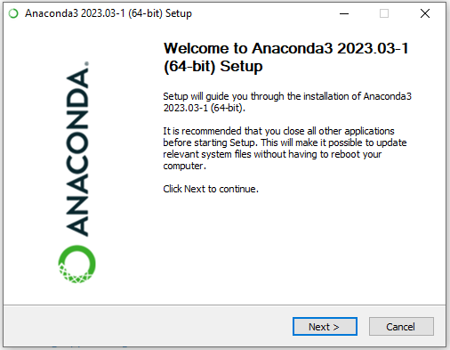  
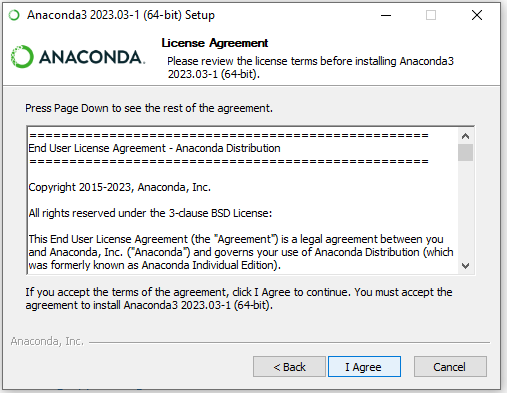  
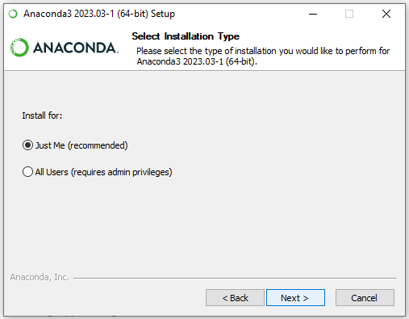  
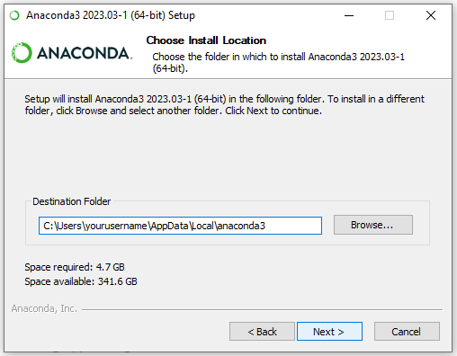  
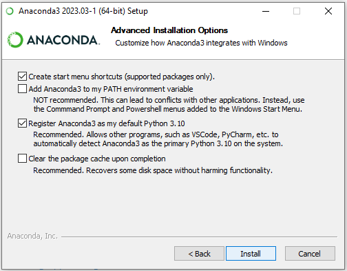  
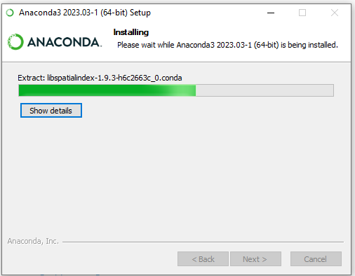 

## Install Git
- Download the correct Git for your OS from https://git-scm.com/download
- Double click the downloaded executable and follow the onscreen prompts:
  
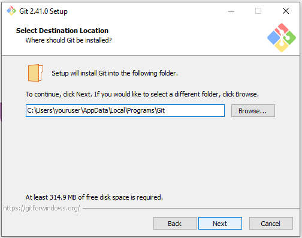  
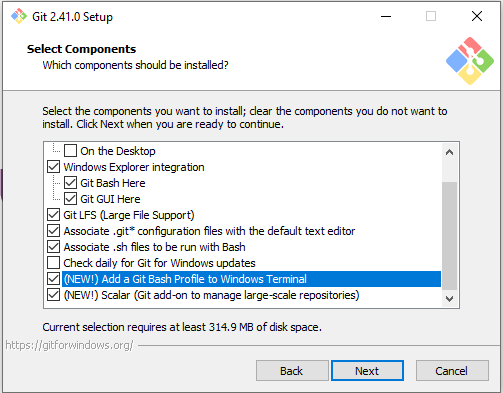  
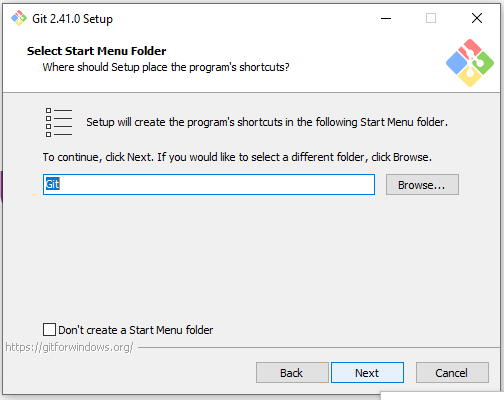  
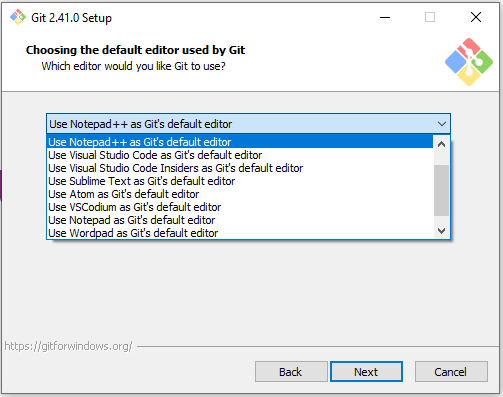  
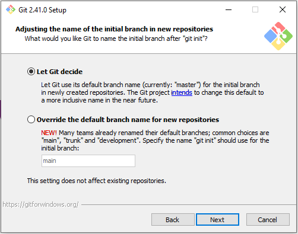  
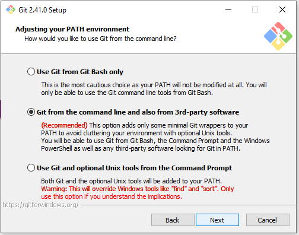  
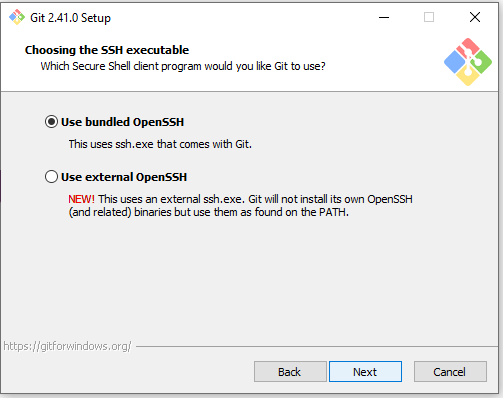  
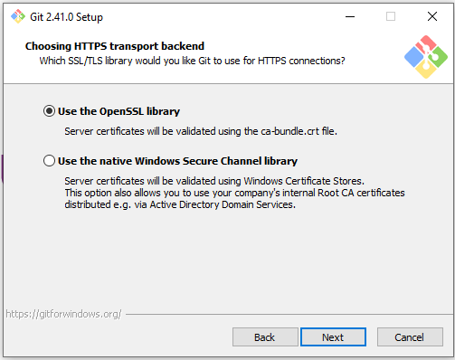  
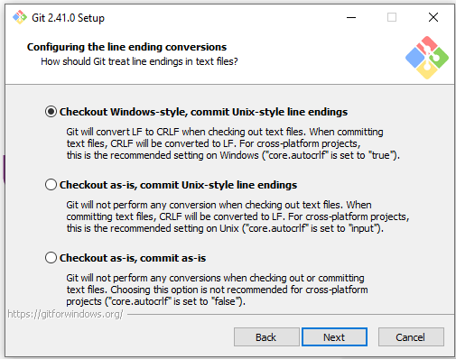  
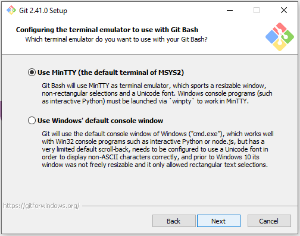  
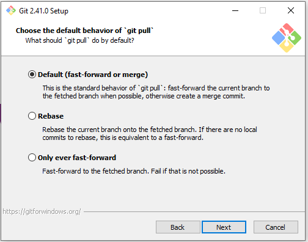  
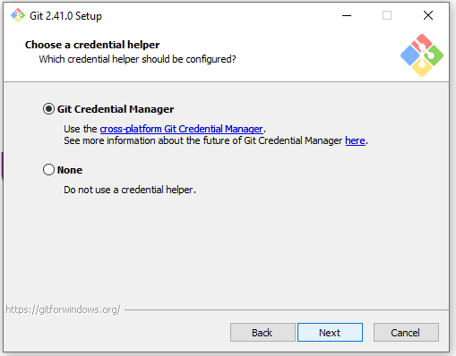  
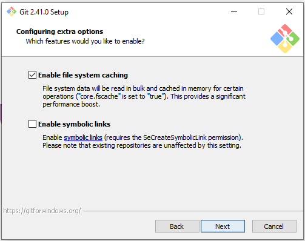  
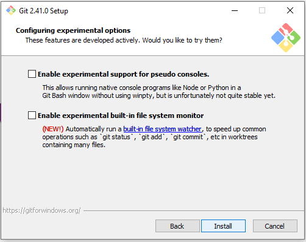  
 
## Basic git config - once off
- Run the **Anaconda Powershell Prompt** (Start menu).

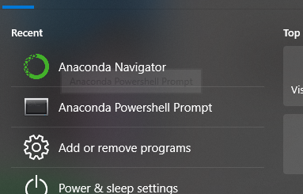  
```bash
# run the following with your details
git config --global user.name "FIRST_NAME LAST_NAME"
git config --global user.email "MY_NAME@example.com"
```

## Clone this repo
- Run the **Anaconda Powershell Prompt** (Start menu).
- Change to your user directory, and clone this repo.
```bash
c:
cd Users\yourusername
git clone https://github.com/philmassie/absa_data_bootcamp_2023.git
```
- you should now have a folder names `absa_data_bootcamp_2023` in your user directory.

## Setup a new Anaconda environment
- Run the **Anaconda Powershell Prompt** (Start menu).
```bash
# change to the project directory
c:
cd Users\yourusername\absa_data_bootcamp_2023
# Update conda
conda update -n base -c defaults conda
conda init
```
### Create a new Anaconda environment
- Run the **Anaconda Powershell Prompt** (Start menu).
```bash
# Try using the supplied `environment.yml` 
conda env create -f environment.yml -v
conda activate absa_data_bootcamp_2023

```
- If the above fails, create the environment manually
```bash
# create the new clean environment
conda create -y -n absa_data_bootcamp_2023 python=3.10
# Activate the new environmentconda activate 
conda activate absa_data_bootcamp_2023
# Install packages
conda install -y ipykernel numpy pandas scikit-learn seaborn lightgbm plotly ipywidgets statsmodels nbformat jupyter
conda install -c conda-forge optuna

```
### Create a new Jupyter kernel from the python environment. 
- Run the **Anaconda Powershell Prompt** (Start menu).
- This allows Jupyter Notebooks to use the new Anaconda environment
```bash
# Activate the new environment
conda activate absa_data_bootcamp_2023
python -m ipykernel install --user --name=absa_data_bootcamp_kernel
```


## Launch Jupyter Notebooks
- Run the **Anaconda Powershell Prompt** (Start menu).
- This allows Jupyter Notebooks to use the new Anaconda environment 
```bash
# change to the project directory
c:
cd Users\yourusername\absa_data_bootcamp_2023
# Activate the new environment
conda activate absa_data_bootcamp_2023
# Start Jupyter notebook server
jupyter notebook
```
With any luck your browser will open a window in your project folder.
- click the `house_prices.ipynb` file to open the notebook
